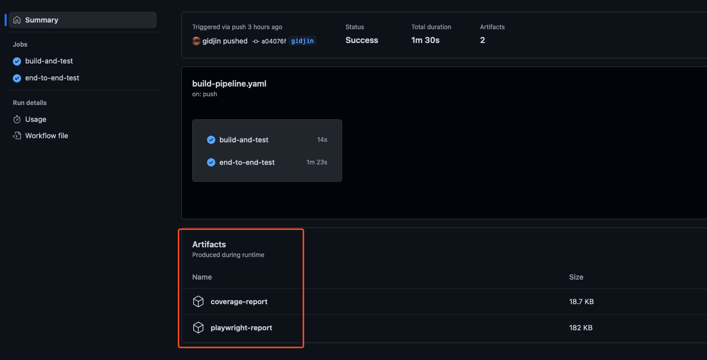
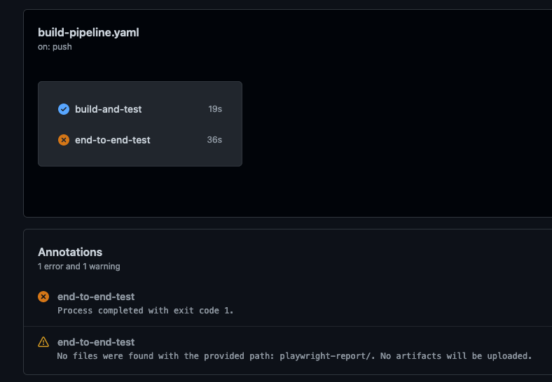
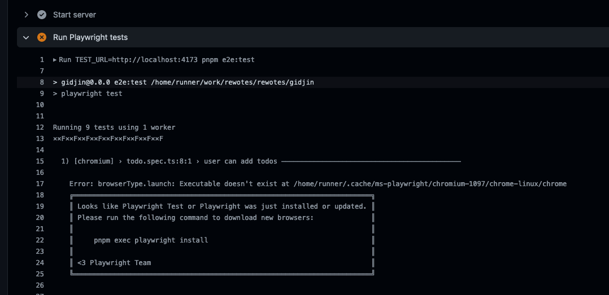
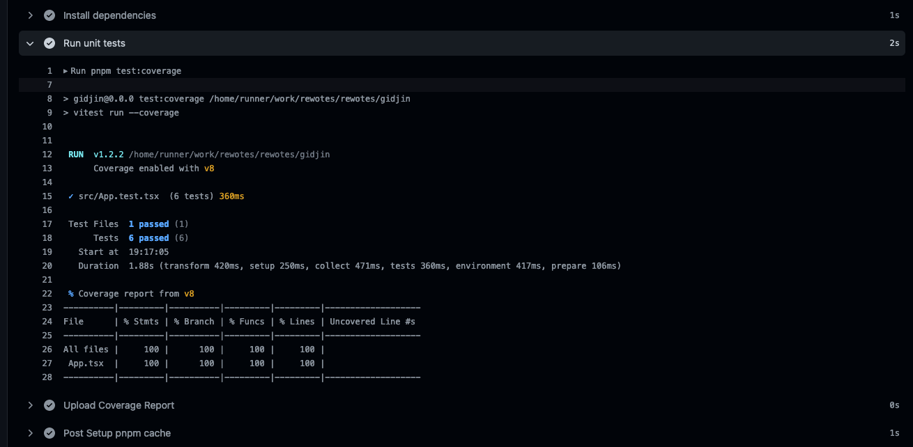

# End-to-end Tests (DevOps)

This is my submitssion for the End-to-end Tests ReWoTe.

# Overview

The aim of this task is to create a simple application package (either python or javascript) that includes
complete application testing infrastructure as well as a complete CICD solution using GitHub workflows.

# Requirements

1. A non-trivial application, e.g. a Flask server with a UI or a React app with a UI with testable components
2. An appropriate end-to-end testing framework implementation (e.g. Cypress) for the application
3. An automated workflow using GitHub actions to verify that the tests pass

## 1. A non-trivial application

I wrote a very basic todo tracking application using [React](https://react.dev/), [TypeScript](https://www.typescriptlang.org/),
and [Vite](https://vitejs.dev/). The application allows a user to add, delete, or edit items on a list.
I chose to just store the items in component state for simplicity.

I have written unit tests as part of my typical [TDD](https://en.wikipedia.org/wiki/Test-driven_development) practice,
and tooling to generate a coverage report as well.

## 2. An appropriate end-to-end testing framework implementation

As per the requirements, and my practice, I wrote an end to end test. I selected the [Playwright](https://playwright.dev/)
framework because of it's advanced developer tools for debugging and writing tests. The tests are setup so that they will
run each test against a running local instance of the application in firefox, chromium, and webkit browsers.

## 3. An automated workflow using GitHub actions

I added a single workflow file for simplicity, it has 2 jobs defined inside. The first `build-and-test` builds the app and
runs all the unit tests and uploads the coverage report to the GitHub Actions summary. The second job `end-to-end-test`
creates a producution build of the app and runs the end to end tests against, and uploads the playwright results to
GitHub Actions summary.

# User story

As a developer of this application I can:

- view important coverage metrics of my application
- be aware of the number of tests running/passing when developing

## How to view coverage metrics

Go to one of the GitHub Action runs and at the bottom of the summary page you will see the artifacts. For example, you
can view [this build](https://github.com/gidjin/rewotes/actions/runs/7856922571) to download and view the `coverage-report`
for that specific run.

## How to be aware of the number of tests running/passing

The build status will be flagged as failing when there are unit test or end to end test failures. For Example, [this build](https://github.com/gidjin/rewotes/actions/runs/7856897480)
failed to pass end to end testing.

By viewing the [logs for the specific job](https://github.com/gidjin/rewotes/actions/runs/7856897480/job/21440157011)
it is easy to identify that the build pipeline did not include the instructions to install the browsers, which are a dependency
for end to end testing.

If you want to see the number of tests or a summary of coverage you can also drill into the specific `build-and-test` job logs.
By looking under the `Run unit tests` step you will see the total number of tests, their passing state, and a report of coverage totals.
For example, here is the output for a successful run from [this job](https://github.com/gidjin/rewotes/actions/runs/7856922571/job/21440208872).

# Possible Improvements

- Remove the rest of the generated css and use tailwindcss to create a cleaner look
- Make use of some additional GitHub Actions like [vitest-coverage-report](https://github.com/marketplace/actions/vitest-coverage-report) to add summary to PRs
- Store todos in a database or browser local storage
- Use a library such as [dnd-kit](https://dndkit.com/) to allow drag and drop rearrangement
- Setup the workflow jobs so that e2e tests only run if unit tests are passing
- Update workflow to run on pull requests and the default branch (main or dev) only vs current configuration to run on the push of any branch
- Move png images to a `docs/images` folder to avoid cluttering up the repo
